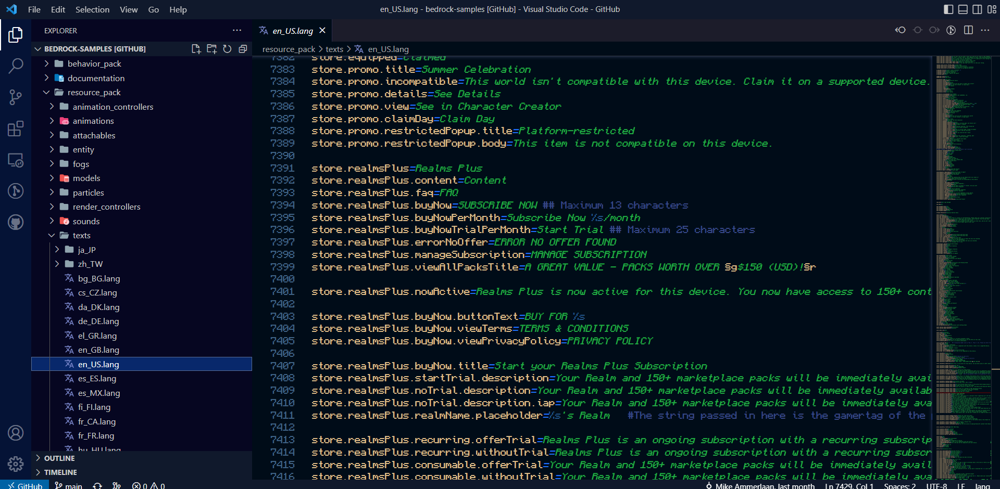

# Minecraft .lang Colorizer <!-- markdownlint-disable MD033 -->

<div align="center">

[](https://marketplace.visualstudio.com/items?itemName=AdamRaichu.minecraft-lang)
[](https://marketplace.visualstudio.com/items?itemName=AdamRaichu.minecraft-lang)
[](https://marketplace.visualstudio.com/items?itemName=AdamRaichu.minecraft-lang)
[](https://marketplace.visualstudio.com/items?itemName=AdamRaichu.minecraft-lang&ssr=false#review-details)

[](https://github.com/AdamRaichu/vscode-minecraft-lang/issues)
[](https://github.com/AdamRaichu/vscode-minecraft-lang/stargazers)
[](https://github.com/AdamRaichu/vscode-minecraft-lang/blob/main/LICENSE)

</div>

This is an extension which colorizes the `.lang`
files that Minecraft uses to store item and entity names,
as well as menu labels.

**Screenshot (Abyss Theme)**


## Usage

Install from the vscode web Extensions view.
Search `adamraichu.minecraft-lang`.

[View this extension](https://marketplace.visualstudio.com/items?itemName=AdamRaichu.minecraft-lang) on the vscode marketplace.

### `§` Highlighting

If you would like the extension to colorize/format `§` operators, add the following to your settings (user or workspace).

```JSON
{"editor.tokenColorCustomizations":{"textMateRules":[{"scope":"string.mc-lang","settings":{"foreground":"#ffffff"}},{"scope":"entity.name.function.format.0.mc-lang","settings":{"foreground":"#000000"}},{"scope":"entity.name.function.format.1.mc-lang","settings":{"foreground":"#0000aa"}},{"scope":"entity.name.function.format.2.mc-lang","settings":{"foreground":"#00aa00"}},{"scope":"entity.name.function.format.3.mc-lang","settings":{"foreground":"#00aaaa"}},{"scope":"entity.name.function.format.4.mc-lang","settings":{"foreground":"#aa0000"}},{"scope":"entity.name.function.format.5.mc-lang","settings":{"foreground":"#aa00aa"}},{"scope":"entity.name.function.format.6.mc-lang","settings":{"foreground":"#ffaa00"}},{"scope":"entity.name.function.format.7.mc-lang","settings":{"foreground":"#aaaaaa"}},{"scope":"entity.name.function.format.8.mc-lang","settings":{"foreground":"#555555"}},{"scope":"entity.name.function.format.9.mc-lang","settings":{"foreground":"#5555ff"}},{"scope":"entity.name.function.format.a.mc-lang","settings":{"foreground":"#55ff55"}},{"scope":"entity.name.function.format.b.mc-lang","settings":{"foreground":"#55ffff"}},{"scope":"entity.name.function.format.c.mc-lang","settings":{"foreground":"#ff5555"}},{"scope":"entity.name.function.format.d.mc-lang","settings":{"foreground":"#ff55ff"}},{"scope":"entity.name.function.format.e.mc-lang","settings":{"foreground":"#ffff55"}},{"scope":"entity.name.function.format.f.mc-lang","settings":{"foreground":"#ffffff"}},{"scope":"entity.name.function.format.g.mc-lang","settings":{"foreground":"#ddd605"}},{"scope":"entity.name.function.format.k.mc-lang","settings":{"fontStyle":"italic bold underline strikethrough"}},{"scope":"entity.name.function.format.l.mc-lang","settings":{"fontStyle":"bold"}},{"scope":"entity.name.function.format.m.mc-lang","settings":{"fontStyle":"strikethrough"}},{"scope":"entity.name.function.format.n.mc-lang","settings":{"fontStyle":"underline"}},{"scope":"entity.name.function.format.o.mc-lang","settings":{"fontStyle":"italic"}},{"scope":"entity.name.function.format.r.mc-lang","settings":{"fontStyle":"","foreground":"#ffffff"}}]}}
```

## Known Issues

You can view issues [here](https://github.com/AdamRaichu/vscode-minecraft-lang/issues).

## Changelog

You can view the changelog [here](CHANGELOG.md).

## See Also

If you are using this extension, you should check out [Zip Extracter](https://github.com/AdamRaichu/vscode-zip-viewer), an extension for unzipping zipped files.
